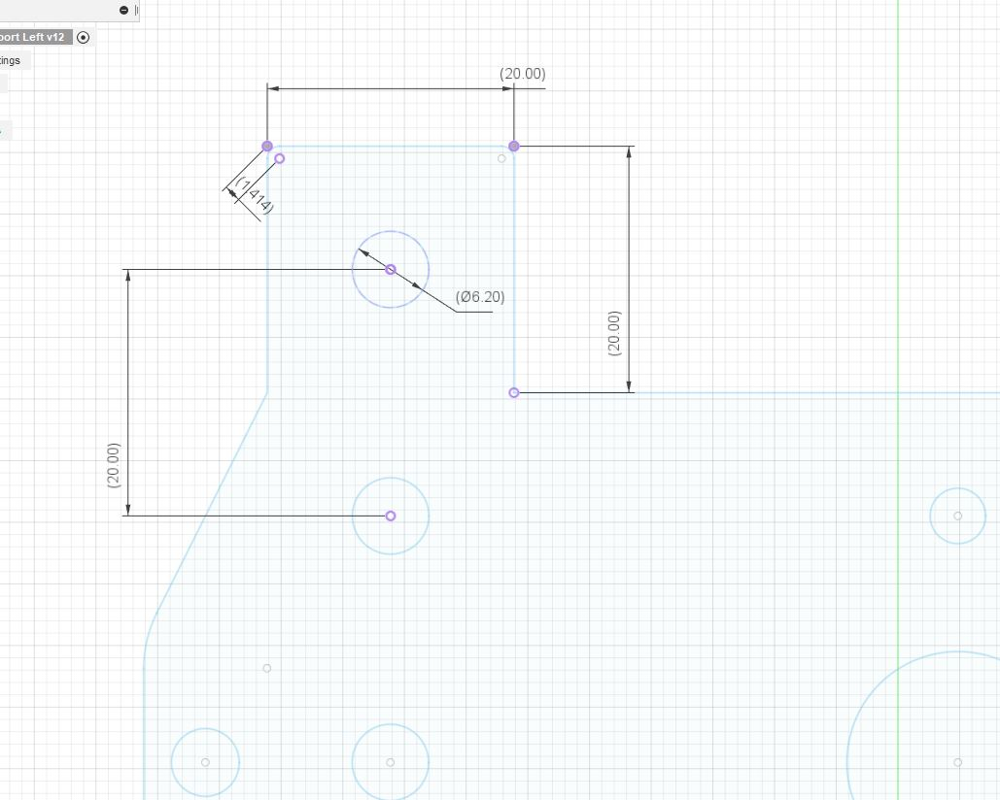

# Carl Edits

The orginal was amazing, I made some small tweaks.

## Motor Support / Screw Support

*left and right*

These are of the original with the addition of a 20mm by 20mm block above the 3 main support screws that mount to the 20x80 Alloy Extrusion. 
I also added an additional 6.20mm hole. 

